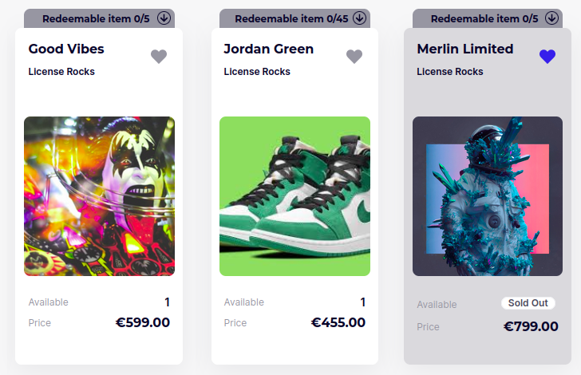
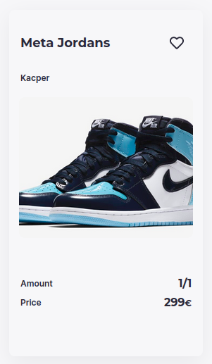

# CreatorsHub Widgets

Would you like to showoff your NFTs on any website in the world?
Try our widgets.


## What is it?

CreatorsHub widget is created to perform embeddable components from creatorsHub, such as NFT item. You can easily add HTML tags to embed your favourites nft's in custom page, with our styles.

## How to use it?

Below is presented an example fo html tags that are required to embed nft item. It will import attached nft:


```html
<div
  id="item"
  data-item-type="NFT"
  data-item-id="120"
  data-app-url="https://preview-creatorshub.license.rocks"
  class="nft-item"
></div>

<link
  href="https://licenserocks.github.io/creators-hub-widgets/main.css"
  rel="stylesheet"
/>
<script src="https://licenserocks.github.io/creators-hub-widgets/main.js"></script>
```

Represented `link` and `script` tags are needed to import dependencies from hosted and built repository. It allows to specify `div` with proper atributes, which will show correct nft with concrete style

```html
<link
  href="https://licenserocks.github.io/creators-hub-widgets/main.css"
  rel="stylesheet"
/>
<script src="https://licenserocks.github.io/creators-hub-widgets/main.js"></script>
```

Below is presented a div which generate in custom page an nft with `id=120`. To import styles and data properly, it is required to use attributes:
`id="item"`
`data-item-type="NFT"`
`data-item-id="120"` - id of nft which you want to embed
`data-app-url="https://preview-licenserocks.de"` - url of an instance from which we take nft data
`class="nft-item"`

Moreover, you can specify the sizes of an NFT, by providing props `data-width` and `data-height`. Please remember, that according to our design, token can not be lower than `492px` and narrower than `275px`. These are minimal, default props of the NFT card.

```html
<div
  id="item"
  data-item-type="NFT"
  data-item-id="120"
  data-app-url="https://preview-creatorshub.license.rocks"
  class="nft-item"
  data-width="300"
  data-height="500"
></div>
```
